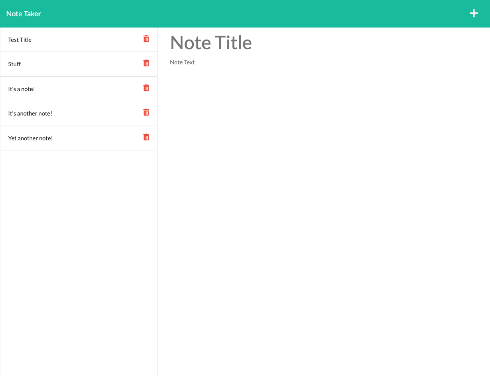

  # Title
Note Taker With Express

## Description
An application to write, save (and delete!) notes as JSON files.

## Table of Contents
* [Installation](#installation)
* [Usage](#usage)
* [Contributing](#contributing)
* [Tests](#tests)
* [License](#license)
* [Questions](#questions)
* [Screenshot](#screenshot)

## License
  
License Info: https://opensource.org/licenses/alphabetical 

## Installation
From the command line, run npm install. Run node server.js.

## Usage
Open index.html in live server, then follow prompts to write, save, and delete notes. 

## Contributing
Feel free to contribute as per license.

## Tests
Try it!

## Questions 
### GitHub Profile link
https://github.com/https://github.com/J-Howell-kc  
### Email
Feel free to direct any questions to howell_j@hotmail.com. Thanks.

## Screenshot
; video link: https://drive.google.com/file/d/1rng8gygslL_4DV-rxr5OMMezcez_5C8x/view